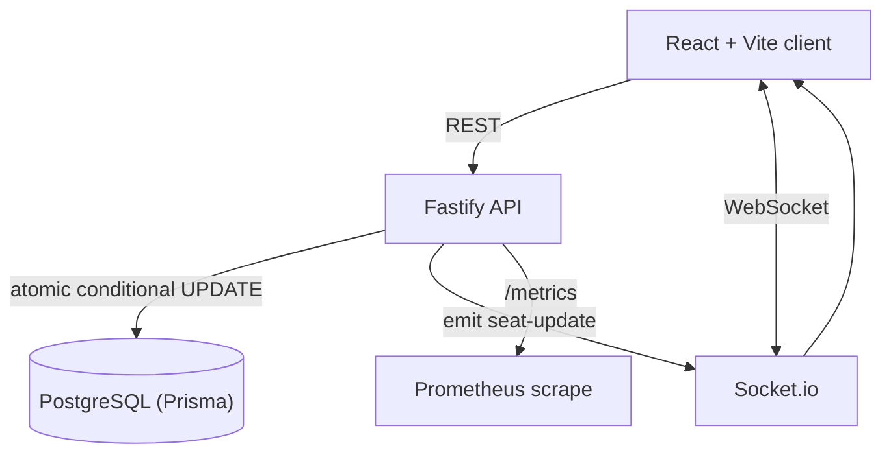
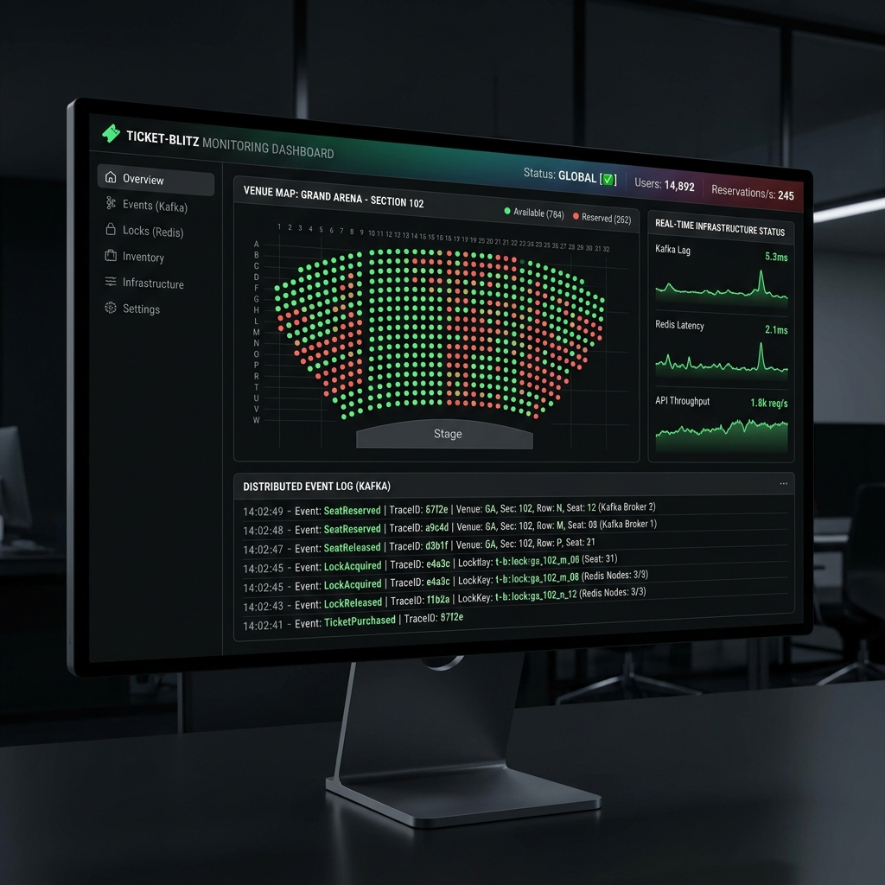

# 🎟️ TicketBlitz — High-Concurrency Event Booking Demo

[](https://github.com/Abhics8/Ticket-Blitz/actions)
[](https://www.docker.com/)
[](LICENSE)
[](https://www.typescriptlang.org/)
[](https://nodejs.org/)
[](https://fastify.dev/)
[](https://react.dev/)
[](https://www.postgresql.org/)

> **A real-time seat-booking demo whose core property is correctness under contention:
> exactly one of N simultaneous bookings for the same seat succeeds — no double-booking.**

> ⚠️ **PUBLIC DEMO / STAGING — NOT PRODUCTION.** The **live** demo runs a build
> with **mock auth** (anyone can book as anyone). Real JWT auth is built and
> tested on the `production-deploy-prep` branch but not yet deployed.
>
> 📍 Current state, live URLs, and next steps: **[PROJECT_STATUS.md](PROJECT_STATUS.md)**.
> Full deploy guide + security checklist: **[DEPLOYMENT.md](DEPLOYMENT.md)**.
> How to generate real benchmark numbers: **[docs/BENCHMARKS.md](docs/BENCHMARKS.md)**.

> **Honesty note:** an earlier version of this README and repo described a
> Redis-distributed-lock + Kafka event-sourcing architecture with a 50k-request
> benchmark. **That subsystem was never wired into the running API** and has been
> removed so this document matches the code that actually runs. The booking
> correctness below is real and reproducible.

---

## 🏗️ Architecture (as it actually runs)



**Booking a seat:**
1. Client `POST /api/book-async` with a JWT (the user comes from the verified token, never the body).
2. The API runs a single atomic statement: `UPDATE seats SET status='BOOKED' WHERE id=? AND status='AVAILABLE'`.
   Only the first concurrent request flips the row; the database decides the winner.
3. Winner → a `Booking` row is created and a `seat-update` event is broadcast over Socket.io.
4. Losers → `409 Conflict` ("seat already taken"). No lock service, no broker, no race.

This is the whole trick: **the conditional `UPDATE` is the concurrency control.**
A second, intentionally race-prone `POST /api/book-naive` endpoint exists purely to
demonstrate the bug the safe path avoids.

---

## ✨ What this demonstrates

- **Race-free booking under contention** — `prisma.seat.updateMany({ where: { status: 'AVAILABLE' } })`
  guarantees exactly one winner. Proven by `scripts/concurrency-check.mjs` and the k6 `oversell` gate.
- **Real authentication** — self-hosted JWT (`@fastify/jwt`) + bcrypt-hashed passwords; booking is
  auth-gated; login is rate-limited.
- **Input validation** — every mutating endpoint validates its body with Zod (400 on bad input).
- **Real-time updates** — Socket.io broadcasts seat changes to all connected clients.
- **Real metrics (not fabricated)** — `GET /metrics` (Prometheus via `prom-client`) exposes
  `bookings_total`, `booking_conflicts_total`, and request-latency histograms; `GET /api/stats` returns
  real seat/booking counts that drive the UI dashboard.
- **Operational hygiene** — `/health` probe, per-IP rate limiting, sanitized 5xx errors, graceful
  shutdown, non-root container, opt-in OpenTelemetry tracing.

---

## 🛠️ Tech stack (actual)

| Layer | Technology |
|---|---|
| **API** | Node.js 20+, **Fastify 5**, TypeScript |
| **Data** | **PostgreSQL** + **Prisma 5** (ORM + migrations) |
| **Auth** | `@fastify/jwt`, `bcryptjs` |
| **Validation** | **Zod** |
| **Real-time** | **Socket.io** |
| **Rate limiting** | `@fastify/rate-limit` (per-IP) |
| **Metrics** | **prom-client** (`/metrics`) + `/api/stats` |
| **Tracing** | OpenTelemetry (opt-in via `ENABLE_TRACING=true`) |
| **Frontend** | **React 19** + **Vite**, `socket.io-client` |
| **Testing** | **Jest** (unit), **k6** + Node harness (load/concurrency) |
| **Deploy** | Docker, Render (API), Vercel (frontend); Kubernetes manifests in `k8s/` |

> There is **no** Redis, Kafka, Express, Drizzle, or message broker in this project.

---

## 🔌 API endpoints

| Method | Route | Auth | Purpose |
|---|---|---|---|
| `GET` | `/health` | — | Liveness/readiness probe |
| `GET` | `/metrics` | — | Prometheus metrics |
| `GET` | `/api/stats` | — | Real seat + booking counts (drives the dashboard) |
| `GET` | `/api/seats` | — | List all seats |
| `GET` | `/api/random-seat` | — | A random AVAILABLE seat (test helper) |
| `POST` | `/api/auth/register` | — | Create account → returns JWT |
| `POST` | `/api/auth/login` | — | Log in → returns JWT (rate-limited) |
| `GET` | `/api/auth/me` | ✅ | Current user from token |
| `POST` | `/api/book-async` | ✅ | **Race-free** booking (atomic conditional UPDATE) |
| `POST` | `/api/book-naive` | ✅ | Intentionally race-prone (educational contrast) |

---

## 📊 Performance & correctness

**No performance numbers are hard-coded in this repo.** The tooling to generate
defensible ones lives in [`docs/BENCHMARKS.md`](docs/BENCHMARKS.md):

- **Correctness (headline):** `node scripts/concurrency-check.mjs` fires N concurrent bookings at one seat
  and asserts **exactly 1 success + (N−1) conflicts, oversell = 0** (exits non-zero otherwise).
- **Latency/throughput:** `k6 run load-test.js` ramps read load with real thresholds
  (`http_req_failed < 1%`, `p95 < 300ms`) and a `successful_bookings <= 1` correctness gate.

Run them against a live API + dedicated Postgres and record what you measure — the
tables in `docs/BENCHMARKS.md` are deliberately left as "Not measured yet" until then.



---

## 🚀 Quick start

```bash
# 1. Clone + install the API (postinstall runs `prisma generate`)
git clone https://github.com/Abhics8/Ticket-Blitz.git
cd Ticket-Blitz
npm install

# 2. Configure environment
cp .env.example .env          # set DATABASE_URL, JWT_SECRET, FRONTEND_URL

# 3. Start Postgres (or point DATABASE_URL at any Postgres)
docker-compose up -d          # Postgres on :5432

# 4. Apply migrations (the API also auto-seeds 100 seats on first boot)
npx prisma migrate deploy
npm run db:seed               # optional: 10,000-seat dataset

# 5. Run the API (http://localhost:3000)
npm run dev:api

# 6. Run the frontend in a second terminal (http://localhost:5173)
cd client
npm install
npm run dev
```

### Quality gates

```bash
npm run lint        # ESLint (flat config)
npm run typecheck   # tsc --noEmit
npm test            # Jest unit tests
npm run build       # compile API -> dist/

# Prove concurrency correctness against a running API:
npm run concurrency-check
```

### Deploy

API on **Render** (`render.yaml` Blueprint), frontend on **Vercel** (root = `client/`).
See [DEPLOYMENT.md](DEPLOYMENT.md) for required env vars and the security checklist.
Container/Kubernetes manifests are in `k8s/` (API Deployment + Service + HPA).

---

## 📁 Project structure

```
Ticket-Blitz/
├── src/
│   ├── index.ts          # Fastify app: auth, seats, booking, /metrics, /api/stats
│   ├── metrics.ts        # prom-client registry + booking counters
│   ├── tracing.ts        # opt-in OpenTelemetry bootstrap
│   └── lib/
│       └── state-machine.ts
├── client/               # React + Vite frontend (seat grid, auth, live stats)
├── prisma/               # schema.prisma + migrations + seed
├── scripts/
│   └── concurrency-check.mjs   # no-k6 oversell proof
├── load-test.js          # k6 load test (oversell + read-load scenarios)
├── tests/                # Jest unit tests
├── docs/                 # architecture, decisions, benchmarks, roadmap
├── k8s/                  # Kubernetes manifests (API)
├── docker-compose.yml    # local Postgres
└── render.yaml           # Render Blueprint
```

---

## 🎯 Honest limitations / future work

- **Demo/staging, not production** — single event, no payments, no seat *holds* (booking is immediate).
- **Single API instance** for real-time — multi-instance Socket.io would need a shared adapter.
- **Live-path test coverage** is still being built out (current tests cover unit logic, not the HTTP handlers).
- Roadmap and trade-off analysis live in [`docs/`](docs/) (`ROADMAP.md`, `DECISIONS.md`, `V2_ARCHITECTURE_PROPOSAL.md`).

---

## 📄 License

MIT — see [LICENSE](LICENSE).

## 👤 Author

**Abhi Bhardwaj** — MS Computer Science, George Washington University (May 2026)

[](https://abhics8.github.io/Portfolio)
[](https://www.linkedin.com/in/abhi-bhardwaj-23b0961a0/)
[](https://github.com/Abhics8)
