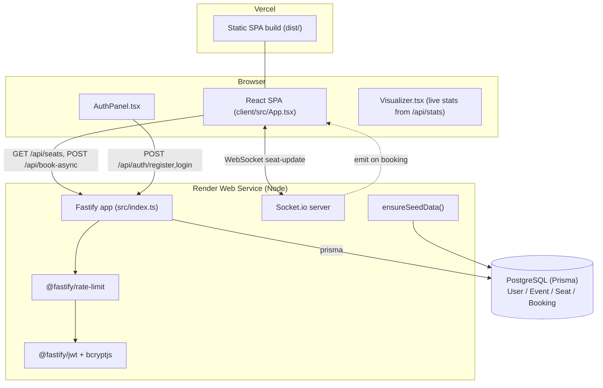
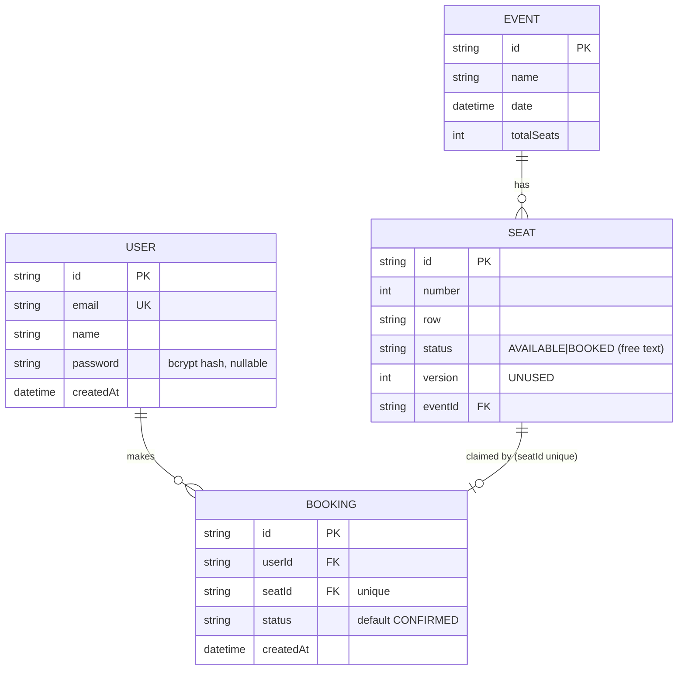

# ARCHITECTURE — TicketBlitz / SeatGuard

Grounded in the actual code. File paths are clickable references.

---

## System overview
A React/Vite SPA (`client/`) talks to a Fastify/TypeScript API (`src/`) over **REST (JSON)** and **WebSockets (Socket.io)**. The API persists to **PostgreSQL via Prisma**. Auth is **stateless JWT**. The live deployment is **Render (API) + Vercel (SPA)**.

The repo also contains **unused container/orchestration configs** (Dockerfile, k8s) that are not part of the running single-service deploy. The earlier unwired Kafka/Redis subsystem (worker + distributed lock) has been **removed** so the repo matches what actually runs.

## Architecture diagram (live path)

> **Removed:** the previous Kafka worker (`src/worker.ts`), Redis distributed lock
> (`src/lib/redis-lock.ts`), and Kafka serializer (`src/lib/kafka-utils.ts`) were
> never imported by `src/index.ts` and have been deleted. The booking path needs
> no broker or lock service — the conditional `UPDATE` is the concurrency control.

## Request lifecycle (booking, live path)
1. Browser click → `handleSeatClick` (`client/src/App.tsx`) sets optimistic `PENDING` state.
2. `POST /api/book-async` with `Authorization: Bearer <jwt>` and body `{ seatNumber }`.
3. Fastify runs hooks: rate-limit → `authenticate` preHandler (`request.jwtVerify()`).
4. Handler validates body with `BookingSchema` (Zod); derives `userId` from `request.user`.
5. `prisma.seat.findFirst({ where: { number } })` → 404 if missing.
6. **Atomic claim:** `prisma.seat.updateMany({ where: { id, status: 'AVAILABLE' }, data: { status: 'BOOKED' } })`. `count === 0` → `409`.
7. `prisma.booking.create(...)`.
8. `io.emit('seat-update', { seatNumber, status: 'BOOKED' })`.
9. All clients update the grid; the booking client also reconciles on the socket event.

## Data flow
- **Reads:** SPA → `GET /api/seats` → Prisma → Postgres → JSON (mapped `number → id` client-side).
- **Writes:** SPA → `POST /api/book-async` → atomic update + insert → Socket.io broadcast → all SPAs.
- **Auth:** SPA → `/api/auth/*` → bcrypt + JWT sign → token in `localStorage` → sent on writes.

## Service boundaries
- **Frontend (`client/`)**: rendering, auth UX, optimistic UI, socket subscription. No business rules beyond display.
- **Backend (`src/`)**: all business rules (availability, atomic claim, auth, validation, rate limiting, broadcasting). Single source of truth.
- **Database**: durable state + the atomicity guarantee (conditional UPDATE).

## Frontend / backend responsibility split
| Concern | Owner |
|---|---|
| Seat availability truth | Backend (Postgres) |
| Double-booking prevention | Backend (atomic UPDATE) |
| AuthN (hash/verify, tokens) | Backend |
| Token storage / attach | Frontend (`localStorage`) |
| Real-time fan-out | Backend (Socket.io) |
| Optimistic UI / reconciliation | Frontend |

## Database relationships

Constraints: `Seat @@unique([eventId, number])`, `Booking.seatId @unique` (one booking per seat). Note: API looks up seats by `number` only (`findFirst`), so it implicitly assumes a **single event**.

## Important modules
| File | Responsibility | Status |
|---|---|---|
| `src/index.ts` | Whole API: plugins, routes, auth, booking, `/metrics`, `/api/stats`, seed, startup/shutdown | **Active** |
| `src/metrics.ts` | Prometheus registry + real booking counters (`bookings_total`, `booking_conflicts_total`, latency histogram) | **Active** |
| `src/tracing.ts` | Opt-in OpenTelemetry (`ENABLE_TRACING`) | Active (off by default) |
| `prisma/schema.prisma` | Data model | Active |
| `prisma/seed.ts` | Seeds 1 event + 10,000 seats (vs 100 in bootstrap seed) | Manual use |
| `prisma/reset.ts` | Resets seat #1 | Dev helper |
| `client/src/App.tsx` | SPA: grid, fetch, socket, booking | Active |
| `client/src/components/AuthPanel.tsx` | Login/register UI | Active |
| `client/src/components/Visualizer.tsx` | "Live Stats" panel — **real** data from `/api/stats` | Active |
| `src/lib/state-machine.ts` | Booking state transitions | Unused in live path (only tested) |

## Third-party integrations
- **@fastify/cors**, **@fastify/rate-limit**, **@fastify/jwt**, **bcryptjs** — active.
- **@prisma/client / prisma** — active.
- **socket.io / socket.io-client** — active.
- **prom-client** — active (`/metrics`).
- **@opentelemetry/** — opt-in tracing.
- **Render**, **Vercel** — hosting. **PostgreSQL** — data.

## Deployment / runtime architecture
- **API:** Render Node web service via `render.yaml`. `npm install && npm run build` → `npm run start:api` (`prisma migrate deploy && node dist/index.js`). Binds `0.0.0.0:$PORT`. Health `/health`.
- **Frontend:** Vercel, root `client/`, build `vite build`, output `dist`, env `VITE_API_URL`.
- **DB:** external Postgres (currently shared Render `contextlens-pg` via `?schema=seatguard`).
- **Unused:** `Dockerfile`, `.dockerignore`, `k8s/{deployment,service,hpa}.yaml`, `Procfile`, `deploy-ticketblitz.sh`.

## Failure points & how to improve
| Failure point | Risk | Improvement |
|---|---|---|
| Single Postgres, shared/free | Outage couples to contextlens app; cold/ephemeral | Dedicated Neon/managed DB; connection pooling (PgBouncer/Prisma Accelerate) |
| `GET /api/seats` full read | Slow with large inventory | Pagination, per-event filter, HTTP caching |
| Hot-seat write contention | Throughput cap on popular seats | A queue/worker path (if load justifies it); or DB row-lock tuning |
| JWT in localStorage | XSS token theft | httpOnly cookies + CSRF tokens |
| No revocation/refresh | Stolen token valid until expiry | Short TTL + refresh tokens + denylist |
| Socket.io `cors.origin` = allowedOrigins but no auth on socket | Anyone can subscribe to seat updates (read-only, low risk) | Authenticate socket connections if data becomes sensitive |
| Render free cold start | ~30–60s first request | Paid tier / keep-warm ping |
| Tests don't cover live code | Regressions slip through | Add API/auth integration tests (see `docs/ROADMAP.md`) |
