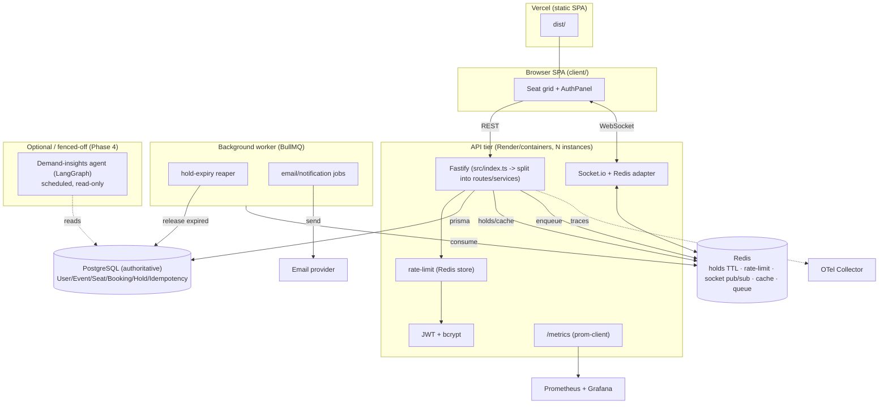

# V2 ARCHITECTURE PROPOSAL — TicketBlitz / SeatGuard

A realistic upgrade that keeps Postgres authoritative, adds Redis for holds/real-time/limits, a background worker for expiry + notifications, and real observability. **No forced AI/cloud.** Optional AI/EKS are clearly fenced off.

---

## v2 architecture diagram

## Request lifecycle (v2 reserve → confirm)
1. `POST /api/holds` (auth) `{ seatNumber, eventId }` → atomic claim to `HELD` with `heldBy`, `heldUntil = now + TTL`; mirror TTL key in Redis; emit `seat-update HELD`. Returns a `holdId`.
2. Client shows a countdown; user confirms (and later, pays).
3. `POST /api/bookings` (auth, **Idempotency-Key** header) `{ holdId }` → verify hold owned + unexpired → transition `HELD→BOOKED`, create `Booking`, store idempotency record; emit `seat-update BOOKED`.
4. If the user abandons, the **reaper** (BullMQ repeatable job) releases `HELD` seats whose `heldUntil < now` back to `AVAILABLE` and emits `seat-update AVAILABLE`.
5. Duplicate confirm with the same Idempotency-Key returns the original result (no double-booking, no double-charge).

## Data flow
- **Authoritative state:** Postgres (`Seat.status`, `Hold`, `Booking`, `IdempotencyKey`).
- **Ephemeral/coordination:** Redis (hold TTL mirror, rate-limit counters, Socket.io pub/sub, `/api/seats` cache, job queue).
- **Async:** BullMQ jobs (reaper, notifications). **Telemetry:** OTel traces → collector; Prometheus scrapes `/metrics`.

## Service boundaries
| Service | Owns |
|---|---|
| API (Fastify) | Validation, auth, atomic claim/confirm, broadcast, metrics |
| Redis | TTL holds, shared limits, socket fan-out, cache, queue transport |
| Worker (BullMQ) | Hold expiry, notifications (no request-path work) |
| Postgres | Durable truth + relational queries |
| Observability | Traces (OTel) + metrics (Prometheus/Grafana) |
| Optional agent | Read-only analytics, never in booking path |

## Database / storage design (additions)
- `Seat.status` → enum `AVAILABLE | HELD | BOOKED` (replace free-text; drop unused `version`).
- New `Hold { id, seatId, userId, heldUntil, createdAt }` (or fold `heldBy/heldUntil` onto `Seat`).
- New `IdempotencyKey { key PK, userId, requestHash, responseJson, createdAt }`.
- Event-scope all seat lookups (`where: { eventId, number }`) to kill the single-event assumption (`src/index.ts:208`).
- Redis: `hold:{seatId}` SETEX = TTL safety net; `seats:{eventId}` cache; `ratelimit:*`; `socket.io#*`; `bull:*`.

## Background job design
- **BullMQ** on Redis. Jobs: `hold-expiry` (repeatable every ~5s, releases expired holds atomically), `send-confirmation` (on booking). Idempotent handlers; DLQ for failures. (This is the *justified, lightweight* alternative to the dormant Kafka stack.)

## AI / agent workflow (optional, fenced)
- A scheduled **LangGraph** read-only agent: `fetchMetrics → detectContentionAnomaly → summarize → (approve) → notifyOrganizer`. Runs in the worker, never inline. Only build if an AI story is explicitly wanted (`docs/TECH_STACK_UPGRADE_ANALYSIS.md`).

## Observability design
- `prom-client` `/metrics`: `http_request_duration_seconds` histogram, `bookings_total`, `booking_conflicts_total` (409s), `holds_active`, **`oversell_total` (alert if > 0)**.
- OTel traces enabled with a collector (Tempo/Jaeger). Grafana dashboards: p95 latency, contention rate, oversell, hold churn. SLOs: oversell=0, p95<300ms, 5xx<1%.

## Deployment design
- **MVP/now:** Render (API) + Vercel (SPA) + managed Redis (Upstash) + dedicated Postgres (Neon). Worker as a second Render service (or same process for demo).
- **Production-grade (Phase 4, optional):** containers → registry → **EKS** (HPA from `k8s/`), **RDS** Postgres, **ElastiCache** Redis, **Terraform** IaC, OTel→Tempo, Prometheus/Grafana. Only with real load to justify it.

## Security design
- Keep token-derived `userId`; add **idempotency** (anti double-charge), **httpOnly cookie + refresh tokens** (XSS hardening), socket auth if data becomes sensitive, secrets via platform env (rotate the leaked DB credential — `PROJECT_STATUS.md`), per-route rate limits (already on login).

## Failure handling
| Failure | Handling |
|---|---|
| User abandons hold | Reaper releases after TTL; Redis TTL is the safety net |
| Duplicate confirm/pay | Idempotency-Key returns original result |
| Redis down | Holds degrade to Postgres-only (TTL via `heldUntil` + reaper); rate-limit falls back to in-memory; real-time fan-out single-instance |
| Worker down | Holds linger until worker recovers; `heldUntil` still enforced at confirm time |
| DB contention on hot seat | Conditional UPDATE serializes; 409 to losers; (Kafka only if load demands) |

## Scaling plan
1. Dedicated Postgres + connection pooling (PgBouncer/Prisma Accelerate).
2. Redis adapter → run N API instances behind a load balancer.
3. Cache `/api/seats`; paginate/event-scope.
4. Only then consider Kafka/EKS with load-test evidence.

---

## Current vs MVP vs Production-grade

| Aspect | Current (live) | MVP target (v2) | Production-grade (Phase 4) |
|---|---|---|---|
| Booking | Instant atomic claim | Hold→confirm + idempotency | + payments, sagas |
| State | Postgres only | Postgres + Redis (holds/cache) | + read replicas, pooling |
| Real-time | Single-instance Socket.io | Redis adapter (multi-instance) | LB + autoscale |
| Auth | JWT in localStorage | + refresh; (cookie optional) | cookie+CSRF, revocation |
| Async | none | BullMQ reaper + notifications | + Kafka/event-sourcing (if justified) |
| Observability | logs + opt-in OTel | `/metrics` + dashboards + SLOs | full APM, alerting |
| Tests | 0% on live paths | auth+booking+hold integration + load gate | + chaos/perf in CI |
| Deploy | Render+Vercel | + Neon + Upstash + worker | EKS/RDS/ElastiCache + Terraform |
| Data scope | single event | multi-event | multi-tenant orgs |
